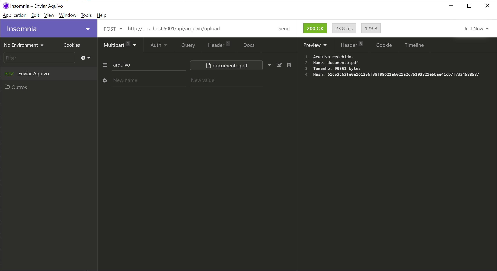

<h1 align="center">🌐 Webservice REST em C#</h1> 

Status do Projeto: Concluído :heavy_check_mark:

*******
## Tabela de conteúdo 
 1. [Descrição](#descricao)
 2. [Funcionalidades](#funcional)
 3. [Pré-requisitos](#prereq)
 4. [Execução](#execucao)
 5. [Teste](#test)
 6. [Tecnologias](#tec)
 7. [Referências](#ref)
 8. [Autor](#autor)

*******

  

## Descrição

O projeto visa criar um webservice REST para upload de arquivos em C#.
- Após o upload, a API deverá retornar o nome do arquivo, seu tamanho e o
seu código HASH (sha256).
- Observações: seguir as boas práticas de código e comitar regularmente as
alterações. A atividade deverá ser entregue no Github, além disso, deverá ser criado um documento (README)
explicando as decisões tomadas para cada objetivo do desafio e o passo-a-passo de como executar o projeto.

  

## Funcionalidades

  :heavy_check_mark: Upload do arquivo  
  :heavy_check_mark: Nome do arquivo  
  :heavy_check_mark: Tamanho do Arquivo  
  :heavy_check_mark: HASH (sha256) do Arquivo  

## Pré-requisitos
1. Antes de começar, você vai precisar instalar o Visual Studio em sua máquina.
2. Também é preciso ter algum cliente REST instalado, como o Insomnia ou Postman.

  

## 🤖Execução
1. Faça o download deste diretório
2. Vá na pasta de download e descompacte o arquivo baixado (clique na opção Extract to "WebAPIAquivos-master")
3. Clique com o botão direito do mouse na pasta descompactada e escolha a opção Abrir com > VisualStudio
4. Depois que o Visual Studio iniciar busque no canto direito o campo Gerenciador de Soluções
5. Busque o arquivo Gerenciador de Aplicativos e clique duas vezes para visualizar os arquivos da aplicação
6. Ainda na aba Gerenciador de Soluções busque o campo Controller e clique duas vezes (você verá o controlador desenvolvido). Para executar, abra a solução no Visual Studio, efetue a construção do projeto com o comando Build e em seguida rode o projeto clicando no botão "IIS Express".

  

## Teste 
Para verificar se o programa está fazendo o upload do arquivo, retornando o nome, tamanho e código HASH do arquivos deve-se:
1. Criar uma requisição do tipo POST com o endereço http://localhost:5001/api/arquivo/upload
2. Selecionar o tipo de dados como Multipart Form
3. Dar um nome ao campo e selecione o arquivo
4. Enviar a requisição
5. O servidor deverá responder com código [200 OK] e exibir as informações sobre o arquivo (nome, tamanho e HASH).

  

### 🛠 Tecnologias

As seguintes ferramentas foram usadas na construção do projeto:

>- [VisualStudio](https://visualstudio.microsoft.com)
>- [Insomnia](https://insomnia.rest)

 

## Referências
Material consultado para a elaboração do projeto:
>- https://docs.microsoft.com/pt-br/aspnet/core/tutorials/first-web-api?view=aspnetcore-5.0&tabs=visual-studio
>- http://www.macoratti.net/20/02/aspc_apimgup1.htm
>- http://csharphelper.com/blog/2018/04/calculate-hash-codes-for-a-file-in-c/
>- https://emn178.github.io/online-tools/sha256_checksum.html
>- https://dev.to/reginadiana/como-escrever-um-readme-md-sensacional-no-github-4509

 

###### Autor: [*Maykon Ferreira*](https://www.linkedin.com/in/maykon-ferreira/).
